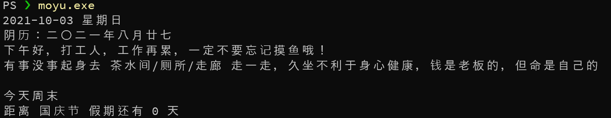

# 摸鱼小助手

一款贴心的命令行工具，在残酷的职场里，时刻提醒你不要忘记摸鱼。

以下是详细文档，**建议上班时间阅读**。

## 主要功能

运行程序时，提醒你该摸鱼啦！

运行效果如下图所示：



### 日历

输出当前日期，阴历 / 阳历 同时输出，让你不会错过每个 传统 / 现代 假期。

### 摸鱼提醒

工作太忙，忘了摸鱼？摸鱼小助手贴心提醒，不要忘了去 茶水间/厕所/走廊 走一走！

### 假期提醒

日历不会看，怕错过假期？别担心！
自动提醒 周末 / 法定假日 距离天数。打工人，不要忘了放假！ 

## 项目依赖

* Python 3

## 安装教程

**建议在上班时间安装。**

下载 / clone 本项目到任意目录，然后运行以下命令即可。

* Windows:
```
pip install 项目目录
moyu.exe
```
* Linux / Mac (未测试)
```
pip install 项目目录
moyu
```

## 建议用法

**建议在上班时间配置。**

让摸鱼小助手在每次打开命令行时出现，需要做以下操作。

* Windows

在 `C:\Users\你的用户名\Documents\WindowsPowerShell\profile.ps1` 文件中最后一行加入一行：

```
moyu.exe
```

* Linux / Mac

在 `~/.zsrhc` 或 `~/.bashrc` 文件中最后一行加入一行：

```
moyu
```

# 打工人，工作再累，不要忘记摸鱼哦！
